# User guide

How to do everyday things in the system, one task at a time. Part A is for everyone, Part B
for residents, Part C for the warden and office staff. Every screenshot uses made-up sample
data.

Contents: [A. For everyone](#a-for-everyone) · [B. For residents](#b-for-residents) ·
[C. For the warden and office staff](#c-for-the-warden-and-office-staff) ·
[D. Using it on a phone](#d-using-it-on-a-phone) · [E. Common questions](#e-common-questions)

The instructions say which role can do each task. Words in **bold** are the names of buttons, tabs
and fields as they appear on screen.

---

## A. For everyone

### Sign in and out

1. Open the hostel's web address (on your own machine: <http://localhost:3000>).
2. Type your email and password and press **Sign in**. The eye icon shows or hides the password.
3. To leave, click your name at the top right and choose **Sign out**.

If your session ends while you are working (after a long time away, or because your password was changed
on another device), you are taken back to the sign-in page with a message.

**Forgotten your password?** Ask the warden, who can set a new one for you (see [Reset a resident's password](#reset-a-residents-password)).

### Find your way around

- The **sidebar** on the left lists what your role can open. Use **Collapse** at its foot for more room.
- **Go to...** at the top (or press `Ctrl`+`K`, `⌘`+`K` on a Mac) opens a search box. Type part of a
  page's name and press `Enter`.
- The **bell** shows how many notifications you have not read.
- Your **name** at the top right opens a menu: **Account and password**, **Reduce effects** and
  **Sign out**.

### Notifications

A notification tells you that something concerning you has happened: leave decided, a payment recorded, a complaint
moved, a bed allocated, a notice posted. Click the **bell** to see the latest, **Mark all read** to clear the count, or **See all
notifications** for the full list with **All** and **Unread** tabs. Each one links to the page it is about.

If the hostel has set up email, you also get an email at the address on your account.

### Change your password

1. Click your name, then **Account and password**.
2. Fill in **Current password**, **New password** (at least 10 characters) and **Type it again**.
3. Press **Change password**. You stay signed in here and are signed out everywhere else.

Use a long password you do not use anywhere else. The account page also has **Reduce motion and effects**,
which stops animation and the 3D scenes on this device. Turn it on if the site feels slow on an older phone.

### Ask the assistant

Open **Assistant**. Choose what you want to ask about:

- **Your records** for things about *you*: "How much do I owe the hostel?", "Is my leave approved yet?",
  "What's for dinner today?" The assistant looks up your own information; it cannot see anyone else's.
- **Rules and policies** for questions about how the hostel works: "When does the gate close?", "How many
  days ahead do I apply for leave?" The answer comes from the hostel's own documents and shows where it
  found it. If the documents do not cover the question, it says so.

You can write in English or Nepali. It answers one question at a time and does not remember the last one, so
put the details in each question. If you see "The assistant is unavailable right now", the hostel has not
switched the AI on, or its daily limit has been reached. Everything else still works.

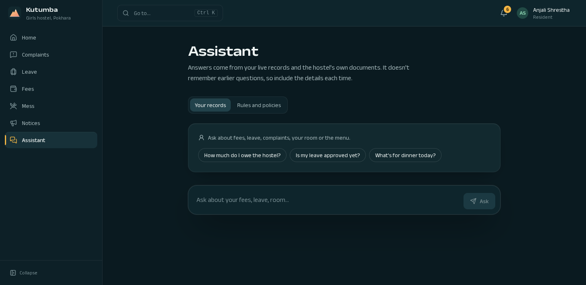

---

## B. For residents

Your home screen shows your room, what you owe, today's meals, the latest notices, your complaints and your
leave requests, with shortcuts to **Report a problem** and **Request leave**.

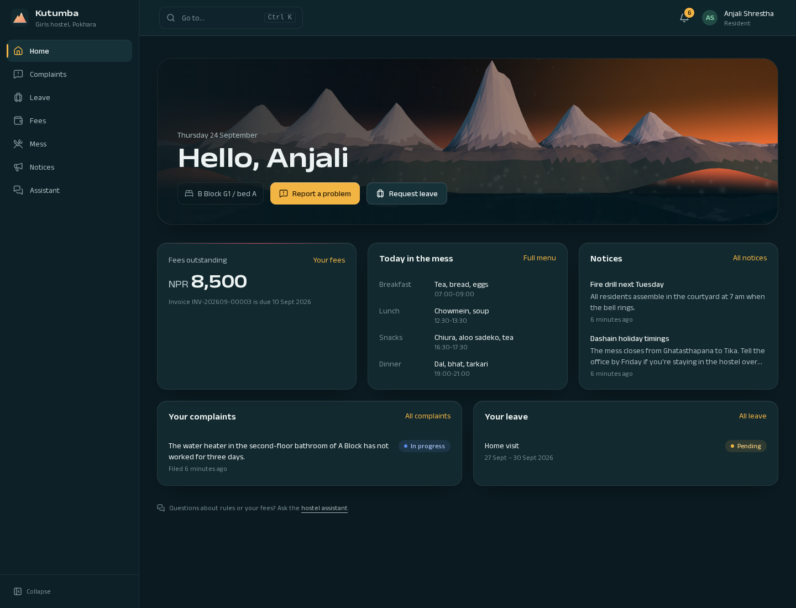

### Report a problem

1. Open **Complaints**.
2. Under **Report a problem**, describe what is wrong and where, in English or Nepali. Write at least 10
   characters. "The tap in the second-floor bathroom has been leaking since Monday" is better than "Tap".
3. Press **Send report**.

It appears at once under **Your reports**. The office can see every report, and you get a notification when its
status changes. Click a report to see what you wrote, how it was sorted (category, priority, who deals with
it) and when it was resolved.

If something is urgent or unsafe, do not wait for the app: tell the warden in person as well.

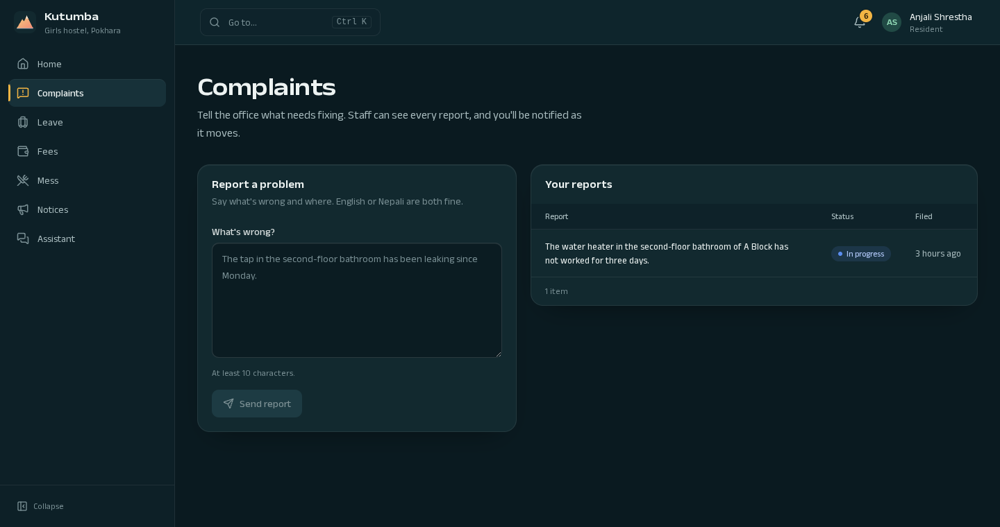

**Statuses:** *Submitted* (received), *Triaged* (sorted), *In progress* (being worked on), *Resolved*,
*Closed* or *Rejected*.

### Ask for leave

1. Open **Leave**.
2. Choose **Reason for leave** (home visit, medical, academic, emergency, other).
3. Set **From** and **To**. The last day cannot be before the first.
4. Optionally say **Where you'll be**, then write **Details** (at least 5 characters).
5. Tick **My guardian knows and agrees** if that is true.
6. Press **Request leave**.

Your request shows as *Pending*. The warden approves or rejects it, and you get a notification with any note the warden adds. Approved leave completes by itself after your last day. Ask for leave *before* you travel.

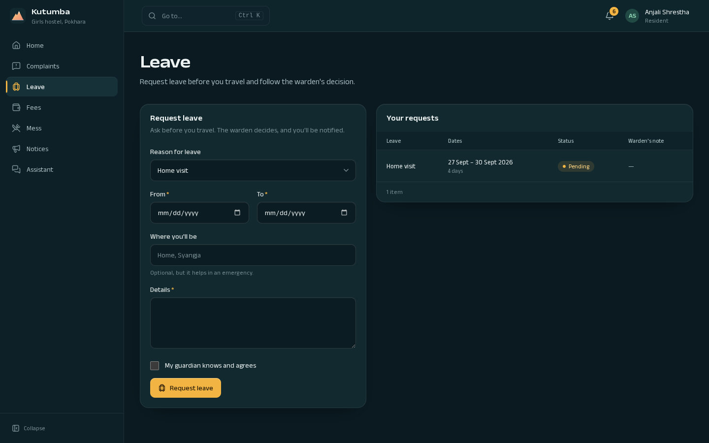

### Check your fees

Open **Fees**. The three tiles show what is **Outstanding** now, what has been **Charged to date** and what you have
**Paid to date**. Below are your invoices (click one for its line items) and your **Account history**: every charge and
payment, newest first.

These figures are calculated from your account each time you open the page, and they are the same figures the
office sees. If something looks wrong, show the warden the invoice number or the date of the payment.

You cannot pay in the app. Pay at the office; staff record the payment and you are notified.

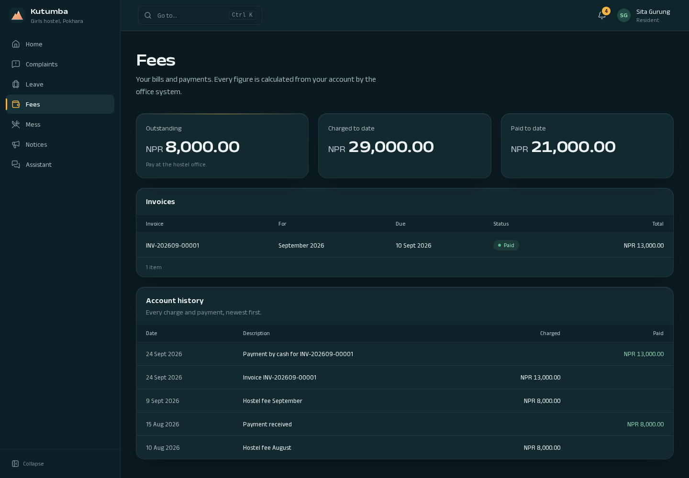

### See the menu and rate a meal

Open **Mess**. **Weekly menu** shows each meal for *Today*; pick another day with the Sun to Sat buttons at its top right.

To rate a meal:

1. Under **Rate a meal**, check the **Date** and **Meal**.
2. Click the stars under **How was it?** (1 to 5). The **Send rating** button stays off until you choose.
3. Add a **Comment** if you like, in English or Nepali. Saying *what* was wrong ("dal was too salty") helps the
   mess team most.
4. Press **Send rating**.

You can rate each meal once. **Your ratings** lists what you have sent.

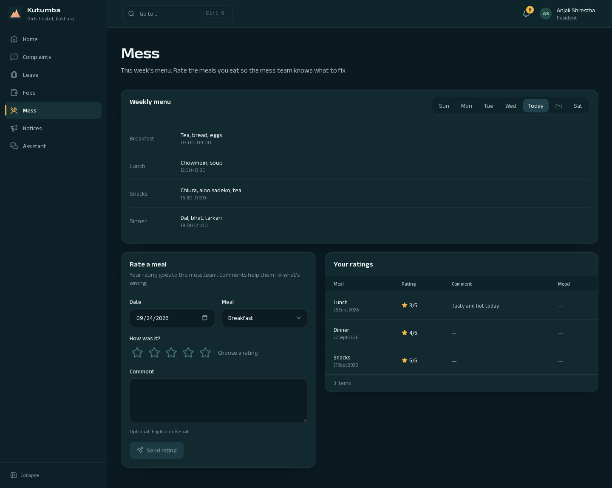

### Read notices

Open **Notices** for announcements from the hostel office. Notices only appear once their publish time has
come and disappear when they expire.

### Notifications page

Click the bell, then **See all notifications**.

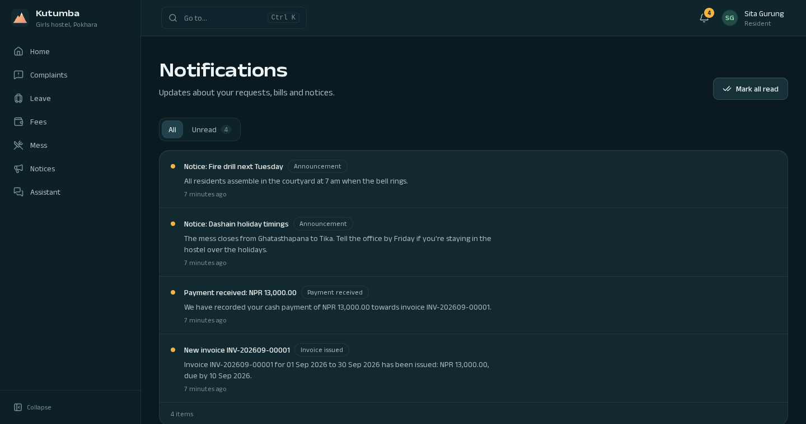

---

## C. For the warden and office staff

Your home screen puts what needs action first: **Needs attention** lists open complaints with the most
urgent at the top, **Leave waiting** shows requests to decide, and the tiles show beds occupied, open
complaints, fees outstanding and the mess rating.

Some tasks are **warden only**; they are marked. Staff accounts do not see those buttons.

### Register a resident

*Staff and warden.*

1. Open **Students** and press **Register a student**.
2. Fill in **Full name**, **Student code** (as printed on the hostel card), **Email** (the resident signs in with it) and
   **First password**. The **New** button next to the password generates a strong one. Everything else
   (mobile, college, program, guardian, admission date) is optional but worth filling in.
3. Press **Register student**.
4. Give the resident the email and first password in person. They should change it under **Account and password**.

Registering does not give the resident a bed. Allocate one next (see below).

### Find and update a resident

*Staff and warden.* On **Students**, type in the search box (name, email or code) or use the status filter, then click a
row. The panel shows the resident's fees outstanding, room, contact details and guardian. **Edit profile** changes any of them.

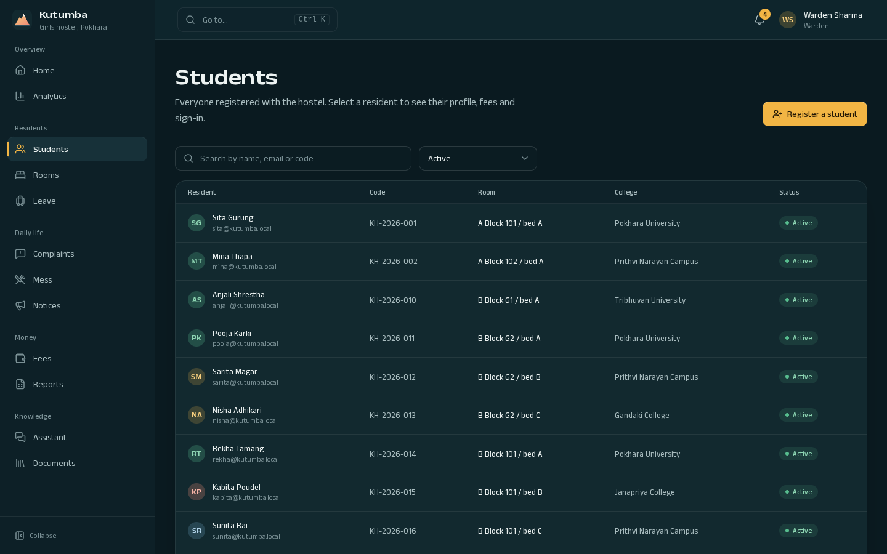

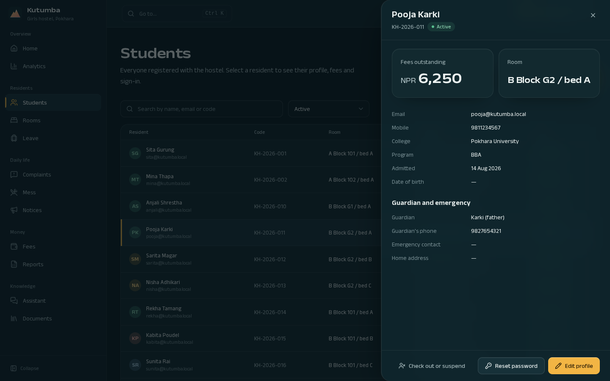

### Set up blocks and rooms

*Warden.* Open **Rooms**.

1. **Add block**: give it a **Name**, the number of **Floors** and an optional **Description**.
2. **Add room**: choose the **Block**, **Floor**, **Room number** and **Type** (single, double, triple or
   dormitory), the number of **Beds** the type allows, the **Monthly rent (NPR)** and the **Status**.
3. The room is drawn in the 3D model and listed in its block. Each block's **...** menu adds a room, edits the
   block or deletes it (only if it has no rooms).

Rooms and blocks that have ever housed a resident cannot be deleted, so history is not lost. Close them instead.
Rooms marked *Maintenance* or *Closed* cannot be allocated.

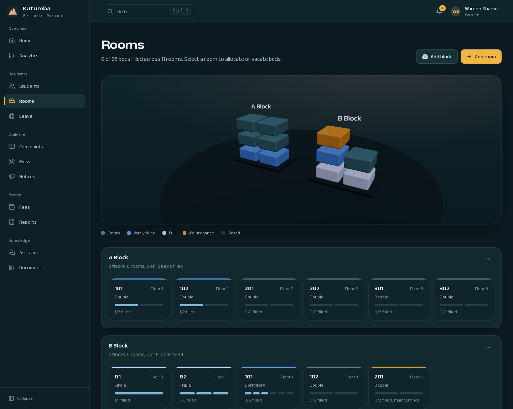

### Give a resident a bed

*Staff and warden.*

1. On **Rooms**, click a room in the 3D model or the grid.
2. Next to a free bed, press **Allocate**.
3. Search for the **Resident** by name, email or code, check **Moving in on**, and press **Allocate bed**.

The resident is notified. A resident can hold one bed at a time, and a bed can hold one resident: the system will not
allow anything else.

To move a resident out, press **Vacate** next to their name and confirm **Vacate bed**. The record is kept. The **...**
menu on a free bed (warden) marks it available, reserved or out of service.

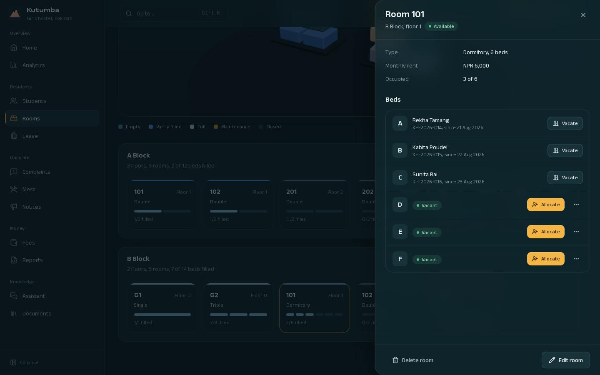

### Deal with complaints

*Staff and warden.* Open **Complaints**. **Open** shows what still needs work; the other tabs show **Resolved**,
**Rejected** and **All**. The most urgent are at the top of the home screen's list.

1. Click a complaint. If AI triage is on, the panel shows the AI's suggestion (category, priority, department,
   summary) marked as advisory. If it says "Not analysed yet", sort it by hand.
2. Under **Triage**, set **Status**, **Priority**, **Category** and **Send to**. You can override anything the
   AI suggested.
3. To add an internal **Staff note**, change the status first: the note is saved with a status change and the
   resident never sees it.
4. Press **Save changes**. When the status changes the resident is notified.

New complaints do not send staff an alert. They appear in this list and under **Needs attention** on the home screen, so
check them regularly.

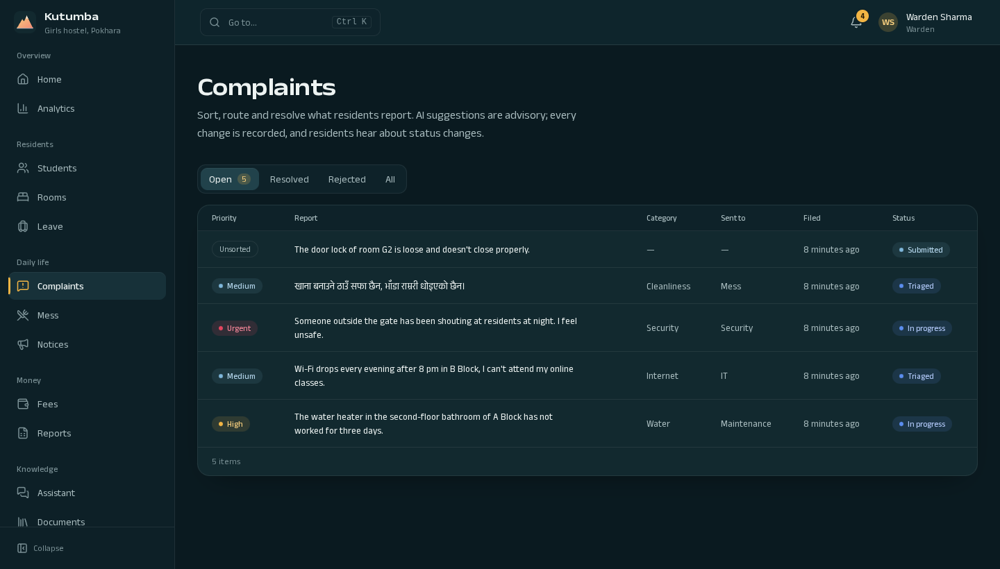

### Decide leave

*Warden decides; staff can view.* Open **Leave**. **Waiting** shows requests to decide; **Approved**, **Rejected**,
**Completed** and **All** show the rest. Click a request to see who asked, the dates, the destination, the reason
and whether their guardian agrees. Add a **Note to the resident** (optional), then press **Approve** or **Reject**. A
request can be decided once. The resident is notified.

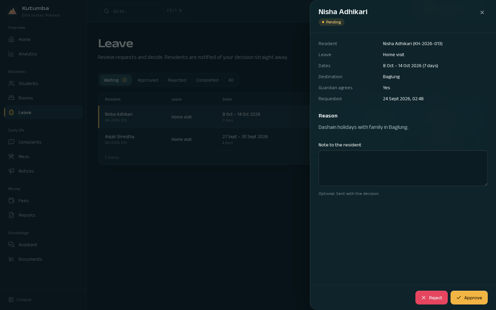

### Money: the fee schedule, monthly billing and payments

Open **Fees**. The tiles show what is outstanding, what has been collected and the collection rate. The **Invoices**
tab lists every invoice, filterable by status and by month; click one to see its line items, what has been paid
and what is left.

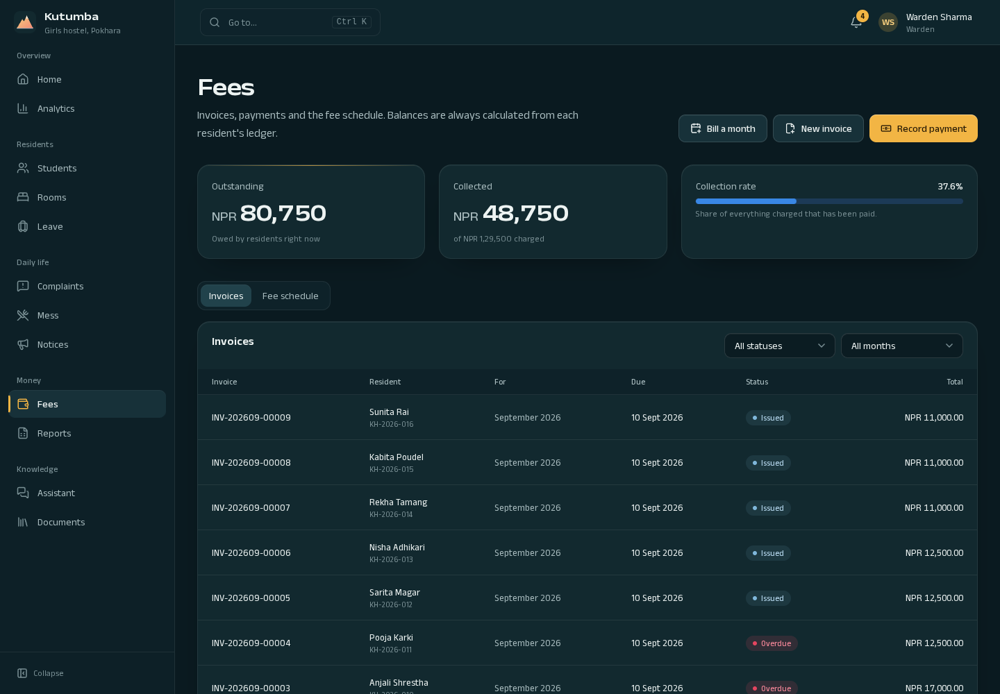

**Set what residents are charged** *(warden).* Room rent comes from each room's monthly rent. Anything else goes
in **Fee schedule > Add fee**: **Name**, **Amount (NPR)**, **How often** (every month, which is billed automatically, or one-time, which you add to
an invoice by hand), **In effect from** and an optional **Until**. To stop a fee, edit its end date; deleting a fee stops future bills but keeps invoices
already issued.

**Bill a month** *(warden).* This runs by itself at 06:00 on the 1st, and you can also do it by hand:

1. Press **Bill a month**.
2. Choose the **Month**. Leave **Due on day** empty for the usual day (the 10th), or enter a day from 1 to 28. If
   that date has already passed, the dialog warns you that the invoices would be overdue immediately.
3. Press **Bill <month>**. The result shows how many invoices were issued, how many were skipped because the
   resident was already billed, and how many had nothing to charge.

Running it again is safe: nobody is billed twice for a month.

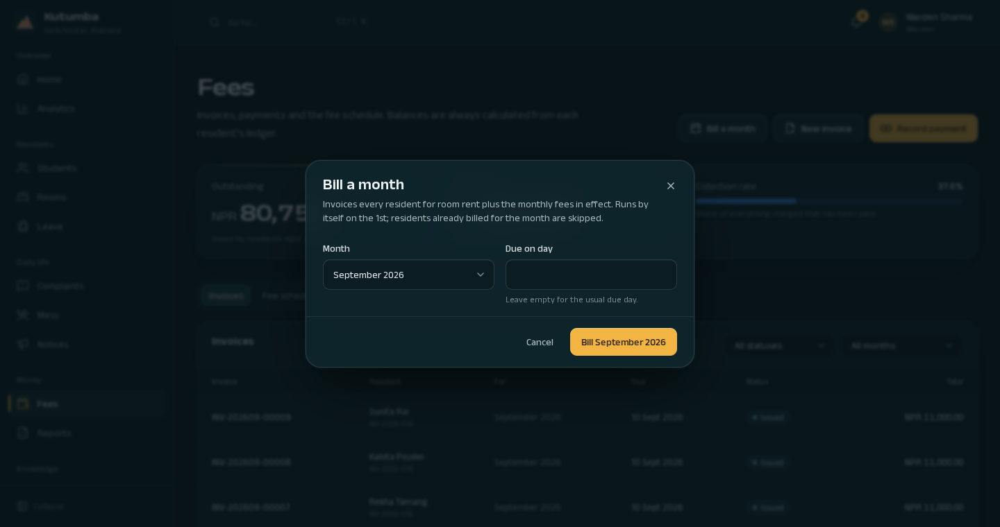

**Record a payment** *(staff and warden).* When a resident pays at the office:

1. Press **Record payment** (or **Record payment** inside an invoice).
2. Choose the **Resident**, then the invoice under **Towards invoice** (leave it empty for an advance or a
   general payment).
3. Enter the **Amount (NPR)** (part payments are fine), **Paid by** (cash, bank transfer, eSewa, Khalti or
   cheque), an optional **Reference** (receipt or transaction number) and when it was **Received**.
4. Press **Record payment**. The invoice updates and the resident is notified. Clicking twice cannot record it
   twice.

**Issue a one-off invoice** *(staff and warden)*, for example a replacement key: **New invoice**, pick the resident,
set the period and due date, add one or more charges with **Add a charge**, and press **Issue invoice**.

### Update the menu

*Staff and warden.* Open **Mess**, pick a day, then click the pencil (or the plus, for a meal not being served) next to a meal. Fill in **What's served** and
**Serving time**, and press **Save menu**. **Stop serving** removes a meal for that day. The staff view of **Mess** also shows
residents' ratings, with the AI's mood and issues if it is on, and the average rating by meal.

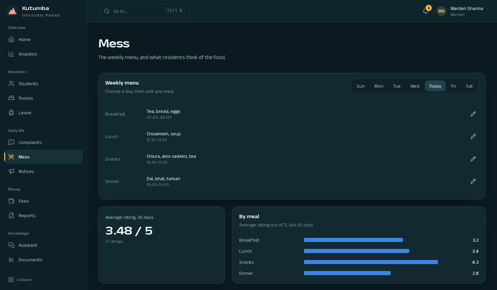

### Post a notice

*Warden.* Open **Notices** and press **Post a notice**. Enter a **Title** and **Message**, choose **Who sees it**
(everyone, residents or staff), and optionally a **Publish** time to schedule it and a **Take down** time. Press **Post notice**.
People in the audience are notified when it goes live. The **...** menu on a notice edits or deletes it. Tick **Include
scheduled and expired notices** to see those too.

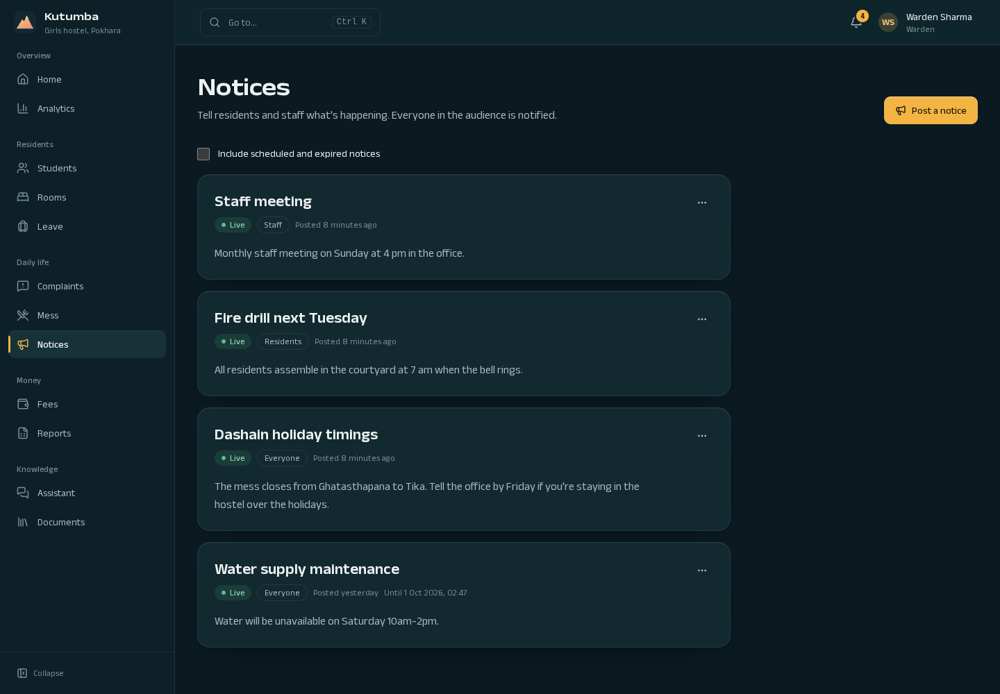

### Teach the assistant the rules

*Warden.* Open **Documents** and press **Upload document**. Enter a **Title**, choose the **Kind of document** and **Language**,
and add a PDF, text or Markdown file (up to 20 MB). Reading and indexing happen in the background: the status goes
from *Uploaded* to *Processing* to *Indexed*. Once indexed, residents and staff can ask about it under **Assistant > Rules
and policies**. If it says *Failed*, use **Read and index again** in the row's **...** menu. **Delete document** removes it and its
search data.

Upload the actual rules, fee policy, leave policy and mess policy. Text you can select is read directly; scanned pages need
the AI to read them. Whatever you upload is what the assistant will quote, so keep it current.

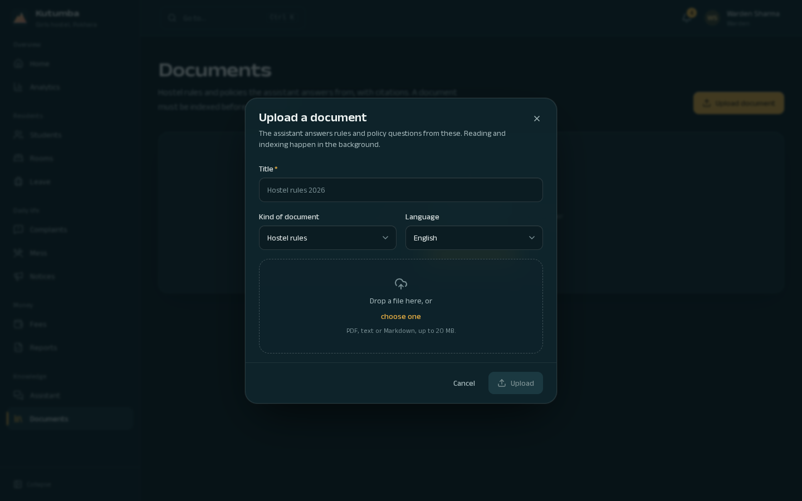

### See how the hostel is doing

*Staff and warden.* **Analytics** shows beds occupied, complaints filed and still open, the median time to resolve, the mess
rating, complaints by category and status, fees collected and ratings by meal, over **30 days**, **90 days** or **A year**. **Write a
briefing** asks the AI to summarise those figures in a few sentences. It explains the numbers; it never makes them.

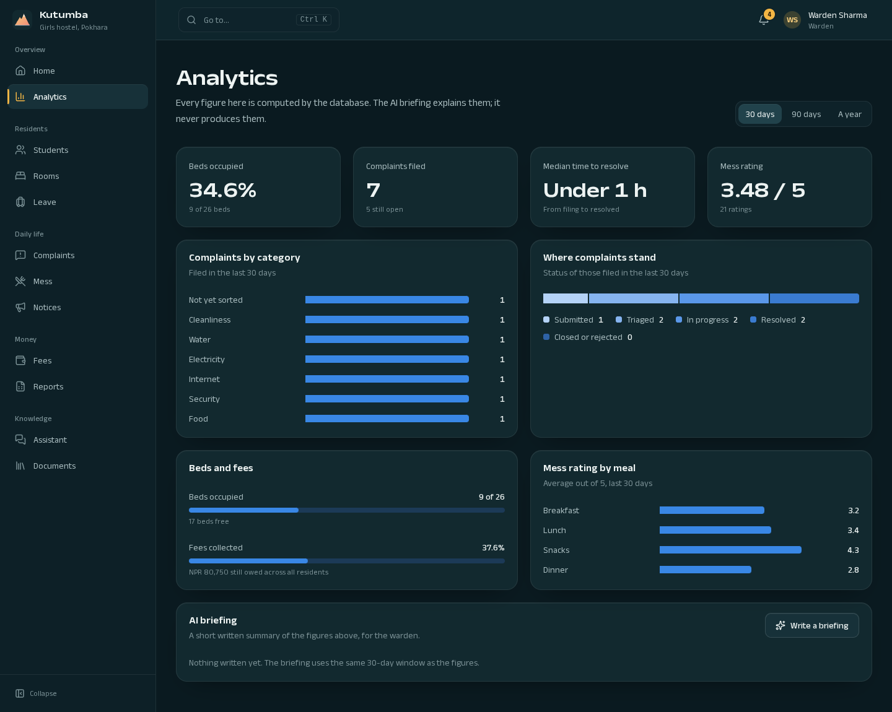

### Download reports

*Staff and warden (some reports warden only).* Open **Reports**, set any options (a status, a month, a date range) and press
**Excel** or **PDF**. The residents and fees reports contain personal data and are for the warden. The complaints report leaves
out who filed each complaint on purpose. Every download is recorded.

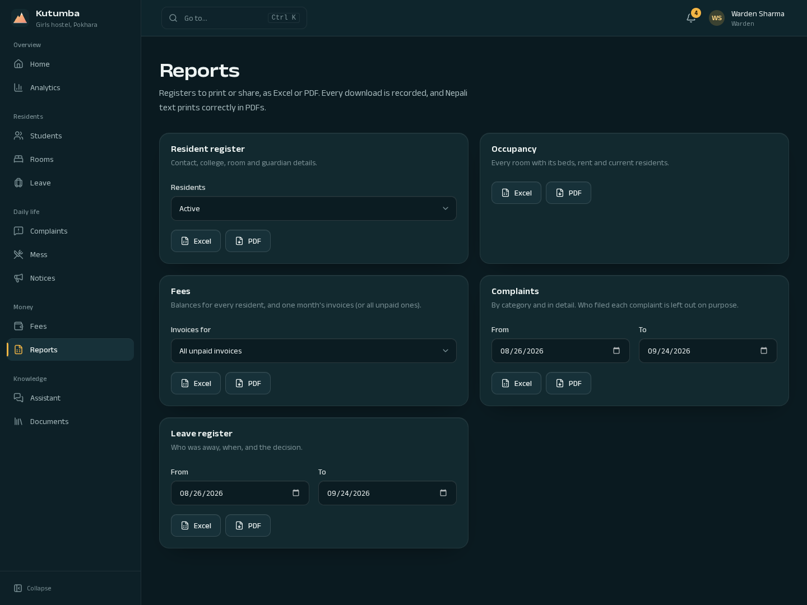

### Check out or suspend a resident

*Warden.* On **Students**, click the resident and press **Check out or suspend**.

- **Leaving the hostel (becomes alumni)**: give a **Reason** and the **Leaving on** date. Their bed is freed and their sign-in is turned off immediately.
- **Suspended**: give a **Reason** and the **Bed released on** date, and tick **Free their bed** or leave it unticked. Their sign-in is turned off immediately.

Press **Check out** or **Suspend**. Their fees, complaints and leave records stay. To bring them back, open their record and
press **Reactivate**, then allocate a bed again.

### Reset a resident's password

*Warden.* Click the resident, press **Reset password**, use **New** to generate a password (or type one of at least 10
characters), and press **Reset password**. The resident is signed out everywhere and notified. Tell them the new password in person.

### Check that emails are going out

*Warden.* If email is set up, open **Notifications** and choose the **Email and SMS log** tab: every email with its status. Press
**Retry failed** to try the failed ones again. If email is not set up, notifications still appear inside the app.

---

## D. Using it on a phone

Everything above works on a phone. The sidebar turns into a menu (the three lines at the top left), tables show their main
columns and keep the detail in the panel that opens when you tap a row, and forms stack. The 3D room model on **Rooms** is for
looking only on a touch screen, so the page still scrolls; the room grid under it is what you tap.

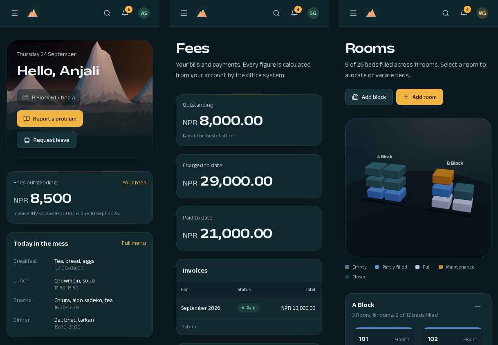

---

## E. Common questions

**Who can see my complaints?** You, and the warden and staff who handle them. Other residents cannot. Reports made from complaints
leave your name out.

**Does the AI decide anything?** No. It suggests how a complaint might be sorted and can summarise or explain, and people make
the decisions. If the AI is off or wrong, the system still works and staff can override it.

**Is my balance really right?** It is added up from your account's list of charges and payments every time. Nobody, and nothing,
types a balance in.

**I filed a complaint but it has no category.** Sorting is done by the AI in the background when it is switched on, otherwise by staff.
Staff will see it in their list either way.

**I cannot see a page someone else can.** Pages depend on your role. Residents, office staff and the warden see different pages.

**The site is slow or the 3D scene stutters.** Turn on **Reduce motion and effects** under **Account and password**.

**The warden gave me a new password.** Sign in with it, then change it under **Account and password**.
