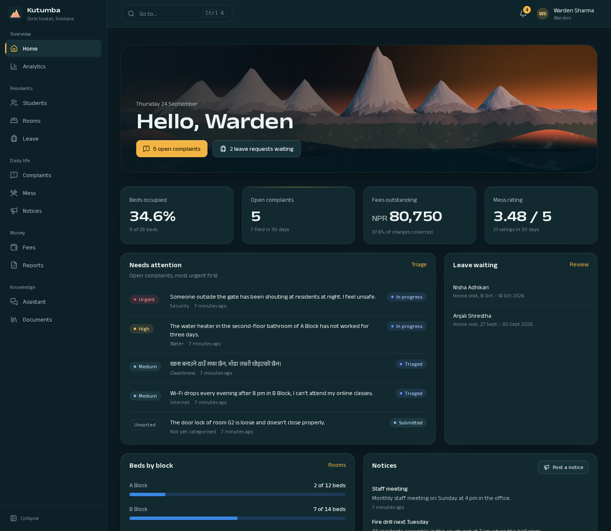

# Documentation

**AI-Powered Smart Hostel Management and Data Analytics System** for Kutumba 1 Girls Hostel,
Pokhara, Nepal.

A web application that puts a hostel's daily running in one place: residents report problems,
ask for leave, see their fees and ask questions; the warden and staff register residents, allocate
beds, handle complaints, approve leave, bill and record payments, publish notices and see how
the hostel is doing. AI suggests, summarises and answers from the hostel's own documents; people
decide.

## Start here

| If you want to... | Read |
|---|---|
| Understand **why the project exists** and how it helps a hostel | [01. Project overview](01-project-overview.md) |
| See **every function**, who can use it and what rules apply | [02. Features](02-features.md) |
| **Install and run it**, configure it, run the tests, prepare to go live, fix problems | [03. Getting started](03-getting-started.md) |
| Learn **how to use it**, task by task, with screenshots | [04. User guide](04-user-guide.md) |
| Understand **how it is built**, its security, its AI, and what is not finished | [05. Technical reference](05-technical-reference.md) |
| Look up an **API endpoint** | [06. API reference](06-api-reference.md) |

**Suggested reading order**

- *The hostel warden or owner:* 01, then 04.
- *A resident:* 04, parts A and B.
- *A supervisor or examiner:* 01, 02, then the [known limitations](05-technical-reference.md#known-limitations) in 05.
- *A developer taking over:* 03, 05, then 06 and the ADRs.

## Quick facts

*As of 24 September 2026.*

| | |
|---|---|
| Roles | Resident, Staff, Warden, Administrator |
| Web app | Next.js (React, TypeScript), works from phone to desktop, English interface, Nepali text supported |
| Backend | FastAPI (Python 3.12), 74 API operations, PostgreSQL with pgvector, Redis, Celery |
| AI | Google Gemini: complaint triage, meal-feedback summaries, assistant, document Q&A with citations, analytics briefing. Optional; the system runs without it |
| Database | 31 tables, 4 migrations |
| Background work | 10 tasks, 7 of them scheduled (monthly billing, overdue marking, reminders, notices, email delivery, leave completion, token clean-up) |
| Automated tests | 132 backend tests. Frontend: type check, lint and build (no automated browser tests in the repository yet) |
| Sample logins | `warden@kutumba.local` / `WardenPass123!`, `sita@kutumba.local` / `StudentPass123!` (development only) |
| Status | Working in development with synthetic data. **Not yet deployed or piloted with real residents; AI accuracy not yet measured** |

## Other documents

| Document | What it holds |
|---|---|
| [`../README.md`](../README.md) | Short project readme: quick start, verification, the API and job tables |
| [`../PROJECT_ARCHITECTURE.md`](../PROJECT_ARCHITECTURE.md) | Detailed backend and data description written before the frontend rebuild (its frontend sections are superseded) |
| [`../DESIGN_SYSTEM.md`](../DESIGN_SYSTEM.md) | The visual design system: palette, type, components, motion, 3D and chart rules |
| [`../FRONTEND_AUDIT.md`](../FRONTEND_AUDIT.md) | The audit of the old frontend and what changed, including bugs found in testing |
| [`adr/`](adr/) | Architecture decision records: why pgvector, why AI tools take no identity, why AI never computes figures |
| [`../ai/evaluation/`](../ai/evaluation/) | Labelled examples and runners for measuring the AI (no results recorded yet) |

## About the screenshots

Every screenshot in these pages was taken from a running copy of the system loaded with made-up sample data:
invented residents, complaints and payments. None shows a real person. The screens that depend on a live AI
key (an AI suggestion on a complaint, an assistant answer, the analytics briefing) are described in words rather
than pictured, because they were not run with a key for this documentation.
